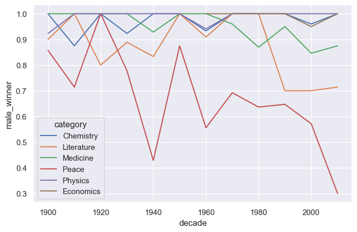

<b>Nobel Prize Project

## 📁Project Presentation

🔳	The Most Nobel of Prizes

<b>The Nobel Prize</b> is maybe the world's most well known scientific award. Except for the honor, prestige and substantial prize plutocrat the philanthropist also gets a gold order showing Alfred Nobel( 1833- 1896) who established the prize. Every time it's given to scientists and scholars in the orders chemistry, literature, drugs, physiology or drug, economics, and peace. 
The first Nobel Prize was handed out in 1901, and at that time the Prize was veritably Eurocentric and manly-focused, but currently it's not poisoned in any way whatsoever. 

📃 Table of Contents
  ##### 🔘	The most Nobel of Prizes
  ##### 🔘	So, who gets the Nobel Prize?
  #####  🔘	USA dominance, visualized
  #####  🔘	What is the gender of a typical Nobel Prize winner?
  #####  🔘  The first woman and man to win the Nobel Prize
  #####  🔘  Repeat laureates
  #####  🔘  How old are you when you get the prize?
  #####  🔘  Age differences between prize categories
  #####  🔘  Oldest and youngest winners
  #####  🔘  Name of the youngest winner!

### 📋 Analyse
   #### 📌 Reading Nobel Prize Data :

      ✔️ nobel = pd.read_csv("./Data/nobel.csv")

#### 📈 visualization of running data :
  ######  US dominance, visualized :

  ###### The proportion of female winners per decade per award category :

 ###### The proportion of male winners per decade per award category :

 ###### The proportion of Nobel Laureates by age :

 ###### The proportion of age trends in different price categories. :

### 📌 Conclusion

  ##### In conclusion, we looked at:

  ##### ✅ Visualization of US Domination

 ##### ✅ Numbers of awards won by male and female winners

 ##### ✅ The visualization of the sex of a laureate either woman or man who receives the Nobel Prize by category

 ##### ✅ The first women and men to win the Nobel Prize.

 ##### ✅ Display of some laureates who obtained more than one nobel prize

 ##### ✅ Display of some laureates who obtained more than one nobel prize

 ##### ✅ Visualization of the age of each winner when they won their Nobel Prize

